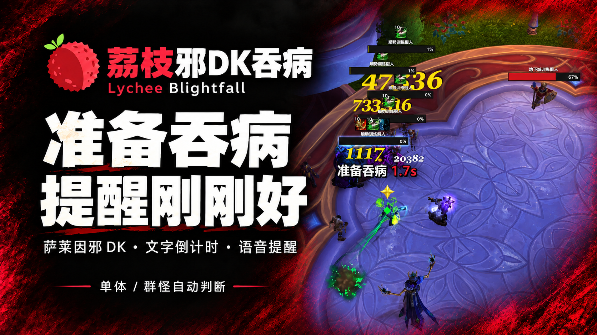
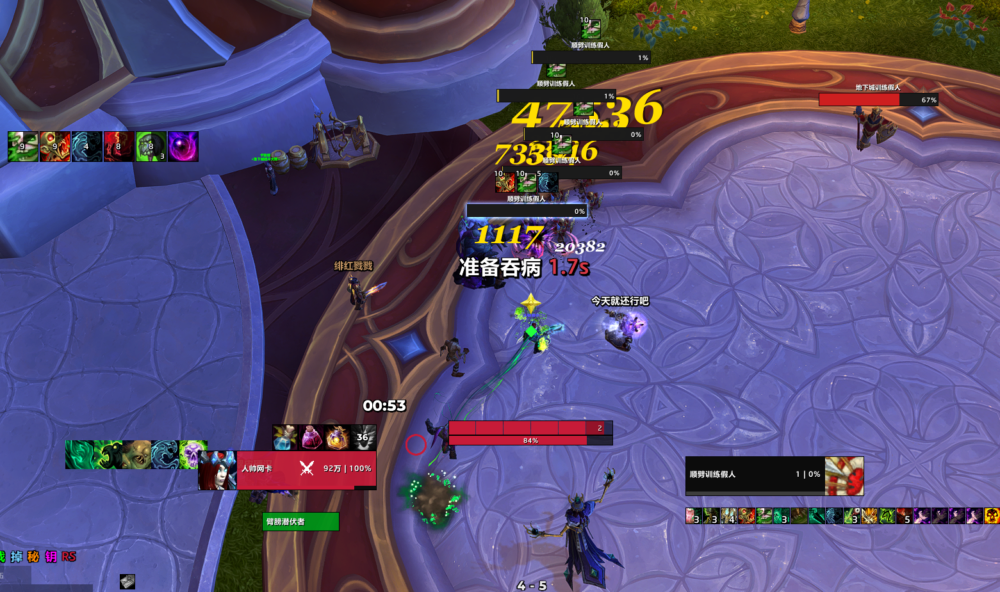
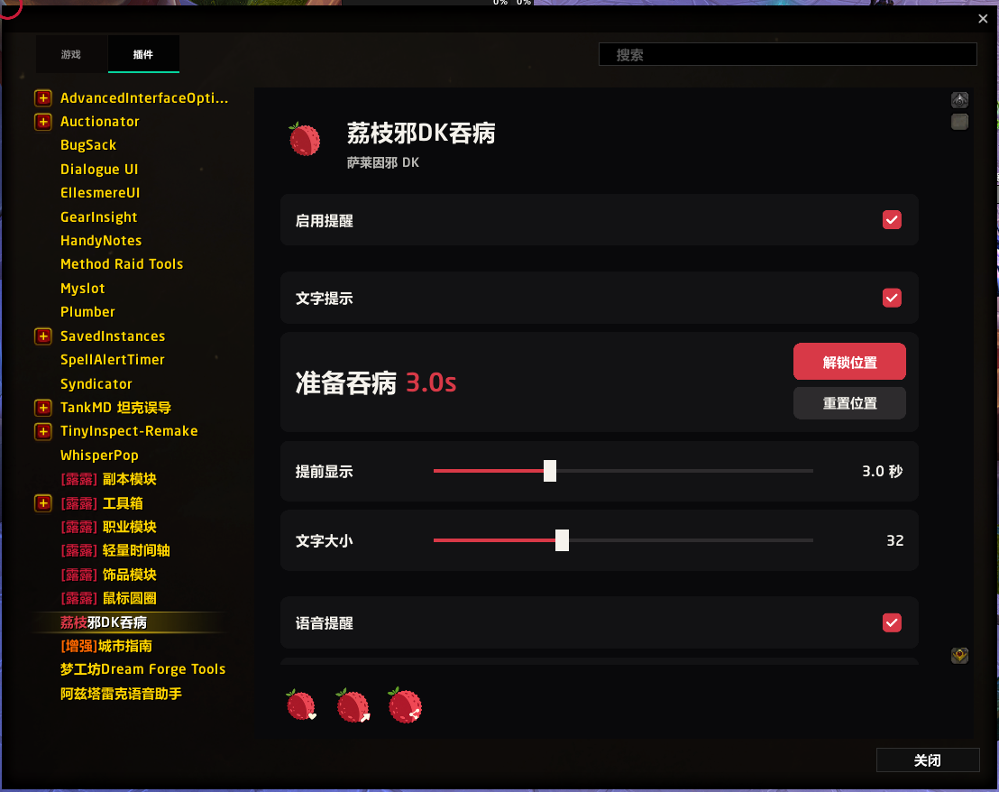
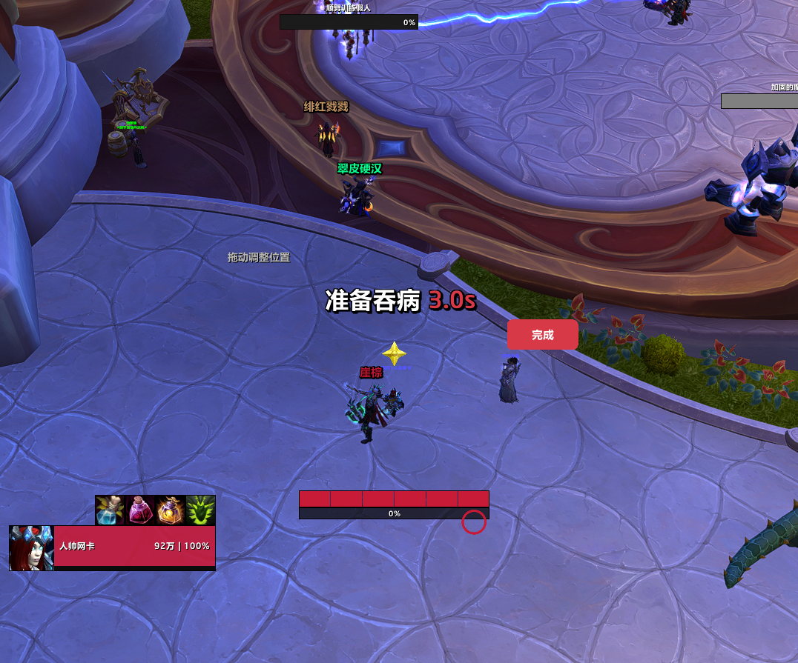

# Lychee Blightfall

[简体中文](README.md) · [Changelog](Changelog.en.md)

A Blightfall reminder for San'layn Unholy Death Knights on Retail. A short countdown and voice cue help you prepare for your next Blightfall without watching another timer.

## Follows your burst window

The addon estimates timing from your successful casts, including Dark Transformation and Soul Reaper. Death Coil and Epidemic extensions update the recommendation as you play. Once the text appears, it stays visible for the current cycle; the voice cue plays at most once per cycle.

Single-target and AoE behavior switch automatically using visible enemy nameplates that are in combat. Keep enemy nameplates enabled for this feature.

Since 1.0.1, an optional Soul Reaper reminder uses an approximately 7-second delay after Dark Transformation, with a default 3-second lead, in both single-target and AoE combat. It requires Soul Reaper and Reaping, cancels when Soul Reaper is cast, and does not move with pet-buff extensions. Blightfall has priority. The unified AoE cue is an addon preference, not SimC's AoE instruction to delay Soul Reaper.

## Make the reminder yours

- Text and voice default to 3 seconds before the recommended timing, with separate toggles and lead-time settings.
- Move the transparent reminder and adjust its font size.
- Includes a default voice cue, SharedMedia sound selection, and sound preview.
- Soul Reaper has its own reminder toggle and sound choice. Both reminders share position, text and voice lead settings.
- Open Esc → Options → AddOns → [荔枝]智能吞病收割提醒. Unlocking closes the settings panel; drag the reminder and click the finish button to lock it.

## Getting started

For Retail 12.1, Unholy specialization, the San'layn hero tree, and the Blightfall talent. It activates when those requirements are met. WeakAuras and Lychee Launcher are not required.

Install through your addon client, or place both LycheeBlightfall and LycheeBlightfall_Core folders in the Retail Interface/AddOns directory. Keep both enabled and restart the game after the first installation.

The current in-game interface, reminder text, and included voice are in Chinese. “准备吞病” means “Prepare for Blightfall.” This English page documents the existing addon; it does not imply an English UI or voice pack.

## About the timing

This is a cast-based estimate, not an automatic rotation or a guarantee of maximum damage. Target changes, pet state changes, and enemies outside nameplate range can affect the recommendation. Use your judgment in combat. Reloading the UI during combat clears the current estimate; the next Dark Transformation starts a new cycle.

## Thanks

小当家 Chef.

Source and feedback: https://github.com/Follen/LycheeBlightfall

## In-game screenshots

These three images are the player's supplied screenshots; the cover is a promotional image.

