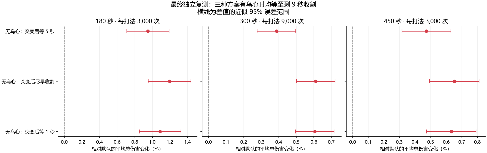

# 单体乌心、收割与吞病：模拟结论

## 推荐

在这套 SimC 萨莱因＋乌心模板中，建议将有乌心与无乌心的收割分开安排：有乌心等到剩余约 9 秒；无乌心的小爆发在黑暗突变后尽早收割。吞病仍放在收割剩余约 2 个 GCD 时，不因缠绕续长突变而一直推后。
“尽早”表示取消额外等待门槛，仍服从原 APL 更高优先级动作及 GCD，并不保证突变后立刻成功施放。相邻 0/1 秒门槛的差异不能解释为实战必须卡精确小数。
这是所测参数中的实用推荐，不是全部天赋、装备和战斗场景的全局最优；本次没有改动插件。

## 方法与范围

官方预编译 SimulationCraft 1210-01，git 4c7c736；WoW 12.1.0.69933 Live，hotfix 2026-09-24。未编译源码。沿用内置 MID2 萨莱因模板，乌心＋祖尔金饰品，其余天赋、装备与 APL 不变。
只改非斩杀收割门槛和单体吞病门槛。固定时长、单目标、完整团队增益、常规递减血量；保留目标低于 35% 的原斩杀分支。因此推荐的等待时间不应覆盖斩杀行为。总伤害包含宠物。
每个配置/时长/种子请求 3001 轮，剔除一轮预热，核查 JSON 的有效 count=3000；每个引擎进程单线程，同一阶段各打法使用相同种子。
粗筛 28 组、细筛 15 组，检查乌心剩余 6～11 秒及半秒邻域、吞病提前 1～2.5 GCD、普通爆发时机和乌心截止保护。第一轮独立验证 20 组。随后补查普通爆发 0～2 秒边界等 10 组，选出更早收割方案。
最终锁定默认、普通爆发等 5 秒、等 1 秒和取消等待四种打法，用全新的 61001/61002/61003 种子复测 300 秒（每打法共 9000 次），62001/63001 分别检查 180/450 秒（每打法各 3000 次）。全部候选都有乌心时等待至剩 9 秒，吞病保留 2 GCD。
本次共 93 组、279,000 个有效样本；前一次比较另有 42,000 个样本。

## 最终独立复测

| 时长 | 打法 | 样本数 | 平均总伤害 | 平均 DPS | 相对默认 | 差值近似 95% 误差半宽 |
|---|---|---:|---:|---:|---:|---:|
| 180 秒 | SimC 默认 | 3000 | 4786.56 万 | 265919.91 | +0.000% | ±0.000% |
| 180 秒 | 无乌心：突变后等 5 秒 | 3000 | 4832.04 万 | 268446.58 | +0.950% | ±0.241% |
| 180 秒 | 无乌心：突变后尽早收割 | 3000 | 4843.85 万 | 269102.66 | +1.197% | ±0.242% |
| 180 秒 | 无乌心：突变后等 1 秒 | 3000 | 4838.66 万 | 268814.61 | +1.089% | ±0.237% |
| 300 秒 | SimC 默认 | 9000 | 8167.57 万 | 272252.48 | +0.000% | ±0.000% |
| 300 秒 | 无乌心：突变后等 5 秒 | 9000 | 8199.22 万 | 273307.46 | +0.388% | ±0.110% |
| 300 秒 | 无乌心：突变后尽早收割 | 9000 | 8217.50 万 | 273916.61 | +0.611% | ±0.110% |
| 300 秒 | 无乌心：突变后等 1 秒 | 9000 | 8217.06 万 | 273901.87 | +0.606% | ±0.110% |
| 450 秒 | SimC 默认 | 3000 | 11702.33 万 | 260051.72 | +0.000% | ±0.000% |
| 450 秒 | 无乌心：突变后等 5 秒 | 3000 | 11757.67 万 | 261281.57 | +0.473% | ±0.157% |
| 450 秒 | 无乌心：突变后尽早收割 | 3000 | 11778.72 万 | 261749.38 | +0.653% | ±0.159% |
| 450 秒 | 无乌心：突变后等 1 秒 | 3000 | 11776.40 万 | 261697.85 | +0.633% | ±0.160% |

## 实战含义与限制

乌心在此模型中持续 20 秒，“剩 9 秒收割”通常意味着乌心开启后约 11 秒，不是亡者大军后 11 秒。实际施法可能受 GCD 和优先级延迟。收割成功后持续 8 秒，吞病在结束前保留约 2 GCD，以实际收割成功时间为起点计算。
乌心这轮后置收割，是为了让收割覆盖更靠后的吞病；但无乌心的轮次，不能据此得出也应该持续等到突变最后一刻。模拟比较的是整场总伤害，单次吞病打得更高不保证整场更高。
一些只留 1 GCD 的组合会漏吞并影响下次突变。例如 heart7_margin1 在 300 秒中的平均吞病次数降到 5.4 次，默认为 7.0 次；不建议贴最后瞬间。
3 秒是提醒提前量，不是吞病必须提前 3 秒施放。无乌心时取消收割等待，单靠突变成功事件无法保证提前 3 秒预告立刻要打的收割；插件若采用此策略，需要即时提示或另行验证提前预判。
本次没有测试 AOE、移动、转火、断档、玩家反应误差或正式服秘密值环境。装备不同和实战损失可能盖过不到 1% 的收益。SimC 使用完整可见状态，这些结果不等于插件可以完整复刻。
近似误差范围按独立样本计算，未把同种子的不同 APL 随机事件当作逐项配对；大量筛选可能挑中偶然高值，所以最终结论使用新的独立种子。并未证明邻近 0 秒与 1 秒门槛有稳定差异。
模型原有 Rune of Unleashed Fire 触发目标/伤害治疗选择未完全验证警告，各组使用同一模型。

## 可复现记录

各阶段 *-plan.json 记录参数和选择理由，*-results.json 保存各组汇总。每组另有完整 .simc、.request.json、.json、.txt 和 .log；confirmation-pooled.csv 为最终表。运行 confirm.py 可按固定请求复现，summarize_confirmation.py 生成本报告。
原始 profile 与官方运行时来源、SHA256 记录在 ../reaper-sim-20260928/manifest.json。源码保留在 ../Simc。
